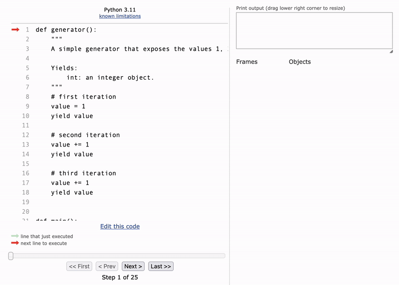

<h2 align=center>Week 02: <em>Day 1</em></h2>

<h1 align=center>Iterators and Generators</h1>

<p align=center><strong><em>Song of the day</strong>: <a href="https://www.youtube.com/watch?v=ifN91YvHj7g"><strong><u>Risk (Official Visualizer)</u></strong></a> by Deftones (2020).</em></p>

---

## Sections

1. [**Iterators**](#1)
    1. [**Definitions**](#1-1)
    2. [**Simulating a `for`-Loop**](#1-2)
2. [**Generators (or, Generator Functions)**](#2)

---

<a id="1"></a>

## Iterators

<a id="1-1"></a>

### Definitions

Today we're going to introduce some names and do some deep dives into Python structures that you are already aware of. Depending on how you were introduced to Python, you might call `range()`, for instance, by different names.

```python
for number in range(10):
    print(number)
```

For example, you might have heard of `range()` being referred to as a(n):

- **function**: something callable using a set of parentheses `()`.
- **sequence**: an ordered collection of python objects (in the above case, the `int` objects `0`, `1`, `2`, ..., `8`, and `9`).
- **iterator**: a Python object we iterate through.
- **generator**: a Python object that generates something.

While there is validity to using all of the above four definitions, today we're going to focus on the last two: iterator and generator. Formally, in Python:

> **Iterable collection**: An object that produces an _iterator_ via the syntax:

```python
iter(iterable_collection)
```

> **Iterator**: An object that exposes a series of values by making subsequence calls to the _`next()` function_.

Let's demonstrate this by taking a simple iterable collection, a list, and operating on it:

<a id="cb-1"></a>

```python
# initialising list
lst = [1, 2, 3]

# printing its type
print(f"The {lst} object is of type {type(lst)}")
```

Output:

```
The [1, 2, 3] object is of type <class 'list'>
```

Now, let's introduce `iter` and `next`:

```python
# converting list using iter()
iterator = iter(integers)

# and printing its type
print(f"The {iterator} object is of type {type(iterator)}")

# using next() to print iterator values
print(next(iterator))
print(next(iterator))
print(next(iterator))
print(next(iterator)) # error
```

Output:

```
The <list_iterator object at 0x10071e310> object is of type <class 'list_iterator'>
1
2
3
Traceback (most recent call last):
  File "~/1134-data-structures-and-algorithms/lectures/02-iterators-generators/code/iter_next.py", line 17, in <module>
    print(next(iterator)) # error
StopIteration
```

<sub>**Code Block 1**: That error in line 17 makes sense; you can't iterate over something that no longer exists.</sub>

<a id="1-2"></a>

### Simulating a `for`-Loop

So, why haven't we ever used these two structures before? More importantly, why do we even care, if the `for`-loop does it for us? Well, the second question answers the first, and the reason you care is that this isn't weenie hut jr. CS 1114 anymore, and we no longer simply care about making things work; we want to now know _how_ these things work, and why.

Python-styled `for`-Loops are actually a relatively "modern" structure. They do a whole deal for us that other languages (like `C`) don't necessarily take for granted. To illustrate this, let us [**simulate**](code/iter_next.py) a `for`-loop with a much simpler structure–a `while`-loop:

```python
"""
We simulate the following for-loop:

string = "abc"

for char in string:
    print(char)
"""
string = "abc"
str_iterator = iter(string)
is_done = False  # flag to stop loop

# while we still have characters...
while not is_done:
    try:
        # attempt to SAFELY expose the next character
        char = next(str_iterator)
    except StopIteration:
        # unless we're done, in which case end loop
        is_done = True
        continue

    # otherwise, simple print the character
    print(char)
```

Output:

```
a
b
c
```

We can simulate the way Python creates `range` objects by following this [**same principle**](code/range_sim.py):

<a id="cb-2"></a>

```python
def simulated_range(start, stop, step=1):
    result = []

    current = start

    while current < stop:
        result.append(current)
        current += step
    
    return result


def main():
    print("Built-in range...")
    for elem in range(3, 10, 2):
        print(elem)

    print("Simulated range...")
    for elem in simulated_range(3, 10, 2):
        print(elem)


if __name__ == "__main__":
    main()
```

Output:

```
Built-in range...
3
5
7
9
Simulated range...
3
5
7
9
```

<sub>**Code Block 2**: Using a list to simulate a `range`.</sub>

For this example, there's virtually no difference, right? _Or is there?_

It turns out that our implementation differs from its built-in equivalent quite a bit. Two things, in particular, set aside the object returned by `simulated_range`, are the facts that the entire sequence:

- was completely "calculated" _before_ the first iteration even began, and...
- is stored (as a list), _all at once in memory_.

Does this mean that `range` objects don't follow either of the statements above? Yes, that _is_ what this means. `range` objects are returned by an entirely different type of Python functions called **generators**.

<br>

<a id="2"></a>

## Generators (or, Generator Functions)

Generators allow you to declare a function that essentially _behaves like_ an iterator. This is why we see a set of `()` after the use of `range` and not, say, after the use of a list.

What's more interesting about generators is that its internal state (that is, the current value it is currently exposing) is maintained on a _call-to-call basis_—meaning it will not generate the next number in the iterator if it is never used.

So, how do we define them? Turns out to be much the same as you define a regular function, except that instead of using the `return` keyword, you use the _`yield` keyword_:

<a id="cb-3"></a>

```python
def generator():
    # first iteration
    value = 1
    yield value

    # second iteration
    value += 1
    yield value

    # third iteration
    value += 1
    yield value


def main():
    gen = generator()
    print(f"The {gen} object is of type {type(gen)}.")

    print(next(gen))
    print(next(gen))
    print(next(gen))
    print(next(gen)) # error

if __name__ == "__main__":
    main()
```

Output:

```
The <generator object generator at 0x102ef6f90> object is of type <class 'generator'>.
1
2
3
Traceback (most recent call last):
  File "~/1134-data-structures-and-algorithms/lectures/02-iterators-generators/code/generators.py", line 31, in <module>
    main()
  File "~/1134-data-structures-and-algorithms/lectures/02-iterators-generators/code/generators.py", line 28, in main
    print(next(gen)) # error
StopIteration
```

<sub>**Code Block 3**: [**Familiar**](#cb-1), no?</sub>

What generators are essentially doing here is breaking down the program's execution and picking it back up again the next time it is called. 

When `yield` is reached, a "snapshot" of the active data frame is taken and stored _together with the position from where the execution should later resume_. We can see this by following our handy [**code visualiser**](https://pythontutor.com/visualize.html#mode=edit):



<sub>**Figure 1**: Memory execution of [code block 3](#cb-3). Video version [here](assets/generators.mov).</sub>

When `next` is called (in the `main` function), the data that was saved is _restored_, and the execution resumes from where it left off. Let's now [**update our simulated range**](code/generators.py) to better match Python's built-in version:

```python
def simulated_range(start, stop, step=1):
    current = start

    while current < stop:
        # expose the current value
        yield current

        # and when execution is picked back up, increase the value of current
        current += step
    
    # no need to return!


def main():
    for integer in simulated_range(3, 10):
        print(integer)


if __name__ == "__main__":
    main()
```

Output:

```
3
4
5
6
7
8
9
```

The type of evaluation that generators use is something known as **lazy evaluation**—that is, the result is an _implicit_ iterable sequence. It...

- ...pauses execution and only exposes an element only when/if it is called.
- ...does not construct a data structure to store the elements all at once in memory (the same way an iterator does).