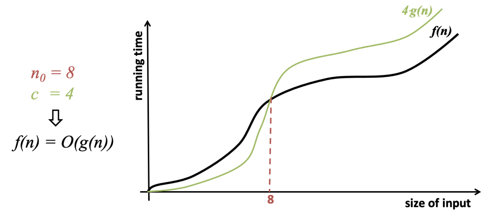
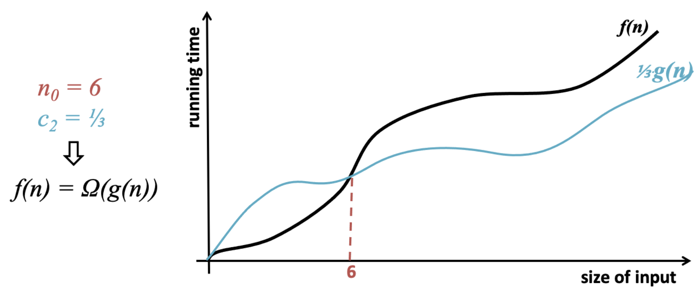
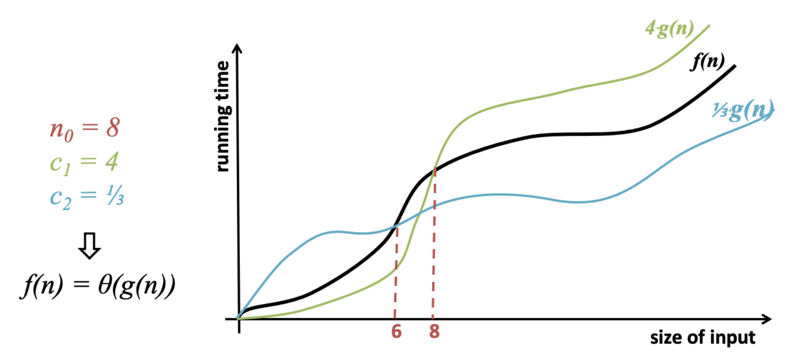

<h2 align=center>Week 02: <em>Day 2</em></h2>

<h1 align=center>Asymptotic Analysis</h1>

<p align=center><strong><em>Song of the day</strong>: <a href="https://www.youtube.com/watch?v=ifN91YvHj7g"><strong><u>Risk (Official Visualizer)</u></strong></a> by Deftones (2020).</em></p>

---

## Sections

1. [**Algorithms And Their Analyses**](#1)
2. [**Testing For Prime Numbers**](#2)
3. [**Runtime Analyses**](#3)
4. [**Asymptotic Analysis**](#4)
5. [**Analysing Code**](#5)
6. **Addenda**
    1. [**Addendum A**](#add1)
    2. [**Addendum B**](#add2)
    3. [**Addendum C**](#add3)

---

<a id="1"></a>

## Algorithms And Their Analyses

Back in the 1930s, Alan Turing low-key changed the world when he created his eponymous [**machine**](https://en.wikipedia.org/wiki/Turing_machine)—that is, a mechanism that can implement any and every algorithm with just a set of inputs and a simple table of rules. The coolest thing about is that this machine is purely _abstract_—it required no specific hardware, let alone software, to work. Despite this simplicity, it was proven to be able to solve _every single computational problem_ possible. How could this possibly be the case?

Well, it helps to define exactly _what_ a computational problem / algorithm actually is. A semi-formal definition of it goes as follows:

> **Algorithm**: A well-defined computational procedure that describes how to transform any given _input_ to its desired _output_.

When we state any such problem we must:

1. Define a set of _legal inputs_, and...
2. Define the _required output_ for each input.

```
              + ————————— +
 input —————> | ALGORITHM | —————> output
              + ————————— +
```

Now, the way that we prove this algorithm will work is by analysing its _correctness_. An algorithm is correct for _every_ valid input if:

1. It terminates (halts) and...
2. It provides the desired output

Makes sense, right? Now, what modern programmers are usually concerned with is with the _performance_ of an algorithm. That is...

- How **long** does it take to execute (time of computation)
- How **much space** it occupies in your computer during execution (usage of either memory or disk storage)

Other things that affect performance are:
- Disk access time, the number of bytes of data, and the number of requests made to the disk.
- The number of processors in your computer (parallelisation)

And many, many more. Now, while we can't do much about the hardware of the machine running our programs, we can certainly design our algorithms towards being _time and space efficient_. In 1114, we didn't really care about performance at all. Now, it is the only thing that matters.

<a id="2"></a>

<br>

## Testing For Prime Numbers

So this has all been kind of abstract, so let's go ahead and do a simple example of algorithm correctness testing—whether or not a number is _prime_ (primality testing). Let us make a formal definition of what it means to be a prime number:

> Let **`num`** be an integer >= 2 (since 2 is the first prime number). We can say that the value `num` is a **prime number** is its only whole number divisors are _1 and itself_.

For example, 13 is a prime number because the only numbers we can divide it by (divisors) are 1 and itself, 13. Any other divisor will result in a fractional number. 12 is not prime because we can calculate a 12 using several combinations of _complimentary divisors_, such as 1, 2, 3, 4, 6, and 12.

```
Complimentary divisors of 12
1 x 12 = 12
2 x 6  = 12
3 x 4  = 12
```

So how can we do this?

### Naïve (Brute Force) Version

The first solution that comes to your head is probably to check every single number from 1 to `num` for divisibility using the following algorithm:

```
VERSION 1
---------
1, 2, 3, 4, ..., num
|                 |
+—————————————————+
  consider every
      number
```

```python
def is_prime_naive(num):
    divisor_count = 0

    for curr in range(1, num + 1):
        if num % curr == 0:
            divisor_count += 1
    
    return divisor_count == 2 # that is, only 1 and num
```

<sub>**Code Block 1**: We call this solution "naïve" because it doesn't attempt any sort of optimisation.</sub>

### First Half Version

Might there be a way for us to test primality without considering every single number from 1 to `num`? Well, it doesn't hurt to try. Let's try cutting the amount numbers in half, and see if only checking either the left half or the right half leads also results in the correct solution:

```
VERSION 1
---------
1, 2, 3, 4, ..., num
|                 |
+—————————————————+
  consider every
      number

VERSION 2
---------
1, 2, 3, 4, ..., num / 2, ..., num
|                    |
+————————————————————+
  consider the left
    half of nums
```

```python
def is_prime_left_half(num):
    divisor_count = 0

    for curr in range(1, num // 2 + 1):
        if num % curr == 0:
            divisor_count += 1
    
    return divisor_count == 1 # that is, only 1


def main():
    num = 13
    print(f"{num} is a prime number: {is_prime_left_half(num)}")

    num = 12
    print(f"{num} is a prime number: {is_prime_left_half(num)}")

if __name__ == "__main__":
    main()
```

Output:

```
13 is a prime number: True
12 is a prime number: False
```

It seems to be working, at least for 13 and 12, but can we prove this to be true for _all_ numbers? Let's go about this in a mathematically appropriate way. If we were to suppose that checking primality on the left side also works, then we can assume that the only divisor on the right side should be the number itself.

Let's call this number on the right side **`k`**.

```
1, 2, 3, 4, ..., num / 2, ..., k, ..., num
|                    |                  |
+————————————————————+——————————————————+
      left half           right half
```

If `k` were to have a complimentary divisor (call it `d`) whose multiplication would result in `num`, then we could either prove or disprove that the right side also _has_ to be checked when it comes to primality. Well, since `d` is `k`'s hypothetical complimentary divisor, we can assume that dividing `num` by `k` would result in `d`:

```
    num
d = ———
     k
```

Now, the smallest value `k` can take in order to be on the right half is `num / 2 + 1`, right? If this is the case, we can substitute `k` with `num / 2` as our "lower limit". This means that `d` has to be a number of the left side because:

1. `d = num / k` gets smaller as `k` gets larger.
2. The smallest `k` in the right half is `num / 2`, and at this point `d = 2`, which is on the left half.
3. As `k` increases further, dd gets even smaller, always staying in the left half.

This leads us to the following inequality:

```
    num      num
d = ——— < —————————
     k    (num / 2)
```

We can simplify this inequality a little further:

```
    num     2 * num
d = ——— < ————————————
     k        num
```

```
    num
d = ——— < 2
     k
```

We thus get the `d` has to be less that 2...meaning it _has to be 1_; there's no other choice. So, if:

```
num
——— = 1
 k
```

Then solving for `k` gives us `num`. The shows that **the only value for `k` (divisor) in the right half _has to be_ `num` itself**. That's the very definition of a prime number. 

Dividing the numbers by half works! This is a great optimisation. For large datasets, cutting the amount of operations by half is huge. We might be satisfied with this result but, could we potentially cut this set of numbers even more?

### Square Root Version

Suppose instead of cutting this set by half we cut it even earlier. How about the square-root of `num`. Why not?

```
VERSION 1
---------
1, 2, 3, 4, ..., num
|                 |
+—————————————————+
  consider every
      number

VERSION 2
---------
1, 2, 3, 4, ..., num / 2, ..., num
|                    |
+————————————————————+
  consider the left
    half of nums

VERSION 3
---------
1, 2, 3, 4, ..., √num, ..., num / 2, ..., num
|                  |
+——————————————————+
   from 1 to √num
```

```python
def is_prime_left_half(num):
    divisor_count = 0

    for curr in range(1, sqrt(num) + 1):
        if num % curr == 0:
            divisor_count += 1
    
    return divisor_count == 1 # that is, only 1
```

Okay, well, let's split these two groups again, getting a left side (smaller) and a right side (larger):

```
1, 2, 3, 4, ... √num, .............................................., num
|                 |          k and d are somewhere in here           |
+—————————————————+——————————————————————————————————————————————————+
     left side                        right side
```

Let's assume that `k` and `d` are complimentary divisors of `num` again. Another way of proving things in mathematics is by something called _contradiction_—that is, if we can prove that `not a` is false, then `a` is true.

In this case, if we suppose that there are values over `√num` for `k` and `d` that result in complimentary divisors of `num`, then we could prove that method 3 doesn't work, since we will have to have checked numbers _over_ `√num`. So, if `k > √num` and `d > √num`, then...

```
k * d = num             k * d > √num * √num
      |                       |
      +———————————+———————————+
                  |
                  v
        num = k * d > √num * √num
```

...wait, though. Doesn't this lead to something weird?

```
num > √num * √num
    |
    v
num > num
```

That's logically not true, meaning that we now have a contradiction! This means that, when considering values for the complimentary divisors, **at least one of them is less than or equal to `√num`**. 

The reason why this proves primality is that by checking for divisors only on the right side (i.e., > `√num`), we indirectly rule out the existence of divisors on the right side (i.e., ≤ `√num`), since every divisor on the right must pair with one on the left. If no divisors exist on the right, then no valid complementary divisors can exist on the left, leaving only 1 and `num` as divisors, which is the definition of a prime number.

We were able to cut the data set, and therefore the algorithm **runtime**, even more!

<a id="3"></a>

<br>

## Runtime Analysis

### Analysing The Runtime of Algorithms

So we know that there are ways to optimise programs. In computer science, we have this measure for analysing the runtime of an algorithm based on the size of the input. So, in our case, primality testing has a runtime based on the size of the data set (i.e. 1 to `num`). In this sense, we could say that we're analysing the runtime as a function like this:

```
T(num), where T stands for runtime
```

In computer science this "size" measure is modelled after the random access memory (RAM) model of computation—that is, any value that occupies constant storage and can be read and/or written in constant time (that is, it never changes regardless of how many times we do it). Examples of operations that execute in constant time are mathematical operations, such as `+`, `-`, `*`, `/`, `sqrt`, `lower`, `upper`, etc.)

Since we can't measure runtime analysis for every single possible input, we sort of generalise by finding instead the order of growth of `T(n)`. In other words, we:

> Find the **asymptotic** order of the number of primitive operations executed by an algorithm as a _function of its input size_.

### Runtime Analysis Based on Input Size

Let's rename `num` to `n`, to generalise it. Let's take our primality testing algorithm:

```python
def is_prime_naive(num):
    divisor_count = 0  # runtime of, say, 4

    for curr in range(1, num + 1):
        # runtime of, say, 5
        if num % curr == 0:
            divisor_count += 1 
    
    return divisor_count == 2  # runtime of 2
```

Note the comments above, denoting that `divisor_count` takes a constant runtime of 4 (I completely made up this number. As long as it's constant, it works). Say that the inside of the `for`-loop takes a constant runtime of 5, and `return divisor_count == 2` takes a runtime of, say, 2. We can thus define this hypothetical runtime (`T(n)`) as follows:

> T<sub>naïve</sub>(n) = 4 + (5 + 5 + 5 + ... + 5)<sub>n</sub> + 2 = **5n + 6**

For our `num / 2` algorithm, the runtime formula would instead be:

> T<sub>half</sub>(n) = 4 + (5 + 5 + 5 + ... + 5)<sub>(n / 2)</sub> + = 5(n / 2) + 6 = **5n / 2 + 6**

And for our `√num` algorithm, the runtime formula would be:

> T<sub>sqrt</sub>(n) = 4 + (5 + 5 + 5 + ... + 5)<sub>(√n)</sub> + = **5√n + 6**

Make sense? So, for asymptotic analysis, we're interested in finding how the runtime (`T(n)`) grows as `n` gets really really large. Say that `n`, for example, equalled 1,000, 1,000,000, and 1,000,000,000:

> T<sub>naïve</sub>(n) = 5,000 + 6 = **5,006**
>
> T<sub>half</sub>(n) = 5,000,000 + 6 = **5,000,006**
>
> T<sub>sqrt</sub>(n) = 5,000,000,000 + 6 = **5,000,000,006**

As `n` grows larger and larger, the value of the constant stops mattering at all. So, in asymptotic analysis, we always drop the low-order terms. Morover, we also ignore the leading constants of the highest-order term:

> T<sub>naïve</sub>(n) = 5n + 6 ≅ n
>
> T<sub>half</sub>(n) = 5n / 2 + 6 = (5 / 2)n + 6 ≅ n
>
> T<sub>sqrt</sub>(n) = 5√n + 6 ≅ √n

To formally express this computer science, we use something called **big-theta** notation:

> T<sub>naïve</sub>(n) has a **Θ(n)** runtime.
>
> T<sub>half</sub>(n) has a **Θ(n)** runtime.
>
> T<sub>sqrt</sub>(n) has a **Θ(√n)** runtime.

<a id="4"></a>

<br>

## Asymptotic Analysis

We use big-theta notation to capture both the _upper and lower bounds_ to describe the exact rate of growth. That is, an algorithm with Θ(√`n`) runtime grows at _exactly the same rate_ as √`n` as `n` gets larger. Now, when designing algorithms, we typically only care about the _upper bound_. Why? Well, it's simply because it _can_ happen. However unlikely, if you algorithm can reach a runtime bound that is too high, you still need to plan around it. Expect the best, prepare for the worst.

In order to consider only the upper bound in asymptotic analysis, we use a slightly different notation—that of big-O. **Big-O notation** describes the upper bound of an algorithm's growth, focusing on its **worst-case** performance as the input size grows. Using our example above in the case of big-O, we can no longer assume that the runtime grows at exactly the same rate as √`n` as `n` gets larger. Instead, we say that we now have two function at play here.

#### Big-O Analysis

Let...

> **f(`n`)**: be the runtime of your algorithm (how many steps it takes as the input size `n` grows).  
>
> **g(`n`)**: be a simple function (like `n`, `n`<sup>2</sup>, log(`n`)) that we use to compare how fast f(`n`) grows.

Using these, we say:

> f(`n`) = O(g(`n`))

That is, the runtime of f(`n`) grows no faster than g(`n`) when `n` is really, really big (worst-case scenario).

The way we prove this is a little abstract, but the actual process is relatively simple. When f(`n`) = O(g(`n`)), we say that there's a constant, `c`, that makes f(`n`) smaller than or equal to `c` * g(`n`). Moreover, there's a certain value of `n` (call it `n`<sub>0</sub>) where this relationship holds for _all `n` bigger than `n`<sub>0</sub>_ (the point where we start saying "really, really big" values of `n`).

Confused? Yeah, I don't blame you. Let's try to concretise this by showing you a simple example. Say that:

> f(`n`) = 3`n`<sup>2</sup> + 6`n` − 15

And we're trying to prove that the following simple function:

> g(`n`) = `n`<sup>2</sup>

can also be used to describe the runtime of f(`n`) (i.e., if _f(`n`) = O(g(`n`))_). The steps to do this are as follows:

1. Pick a value for our constant `c` that would satisfy the inequality f(`n`) <= `c` * g(`n`). In this case, any constant greater than or equal to 3 works, as it must match the coefficient of the dominant term (3`n`<sup>2</sup>) while accounting for the smaller terms (+6`n` − 15). Let’s choose `c = 4`. We thus get:

> f(`n`) = 3`n`<sup>2</sup> + 6`n` − 15  
>
> g(`n`) = 4`n`<sup>2</sup>

2. Write the inequality out. We ask ourselves: is f(`n`) <= `c` * g(`n`) for all `n` >= 1? Let’s see:

> 3`n`<sup>2</sup> + 6`n` − 15 <= 4`n`<sup>2</sup>  
>
> For `n` = 5:  
> 3(5)<sup>2</sup> + 6(5) − 15 <= 4(5)<sup>2</sup>  
> 75 + 30 − 15 <= 100  
> 90 <= 100  

3. Confirm correctness. Since the inequality holds for all large `n`, f(`n`) has a worst-case runtime (an upper bound) of O(`n`<sup>2</sup>).

  
<sub>**Figure 1**: Here's how this upper bound might look, visually.</sub>

---

#### Big-Omega Analysis

Now that we’ve talked about Big-O and how it gives us an **upper bound** on how fast an algorithm grows, let’s switch perspectives. What if we wanted to describe a **lower bound** instead—how fast the algorithm is guaranteed to grow, even in the **best-case scenario**?

That’s where Big-Omega (Ω) comes in.

Let...

> **f(`n`)**: be the runtime of your algorithm (how many steps it takes as the input size `n` grows).  
>
> **g(`n`)**: be a simple function (like `n`, `n`<sup>2</sup>, log(`n`)) that we use to compare how fast f(`n`) grows.

Using these, we say:

> f(`n`) = Ω(g(`n`))

That is, the runtime of f(`n`) grows **at least as fast** as g(`n`) when `n` is really, really big (best-case scenario).

The way we prove this is similar to Big-O, but flipped around: when f(`n`) = Ω(g(`n`)), we say that there’s a constant, `c`, that makes f(`n`) **larger than or equal to** `c` * g(`n`). Moreover, there’s a certain value of `n` (call it `n`<sub>0</sub>) where this relationship holds for _all `n` bigger than `n`<sub>0</sub>_ (the point where we start saying "really, really big" values of `n`).

Still a bit abstract? Let’s use a simple example to clarify. Say that:

> f(`n`) = 3`n`<sup>2</sup> + 6`n` − 15

And we want to prove that:

> g(`n`) = `n`<sup>2</sup>

is a valid lower bound for f(`n`) (i.e., if _f(`n`) = Ω(g(`n`))_). Here’s how we do it:

1. Pick a value for our constant `c` that satisfies the inequality f(`n`) >= `c` * g(`n`). In this case, any constant less than or equal to 3 works, as it must reflect the coefficient of the dominant term (3`n`<sup>2</sup>) without overestimating. Let’s pick `c = 2.5`. We now compare:

> f(`n`) = 3`n`<sup>2</sup> + 6`n` − 15  
>
> g(`n`) = 2.5`n`<sup>2</sup>

2. Write the inequality out. We ask ourselves: is f(`n`) >= `c` * g(`n`) for all `n` >= 1? Let’s check:

> 3`n`<sup>2</sup> + 6`n` − 15 >= 2.5`n`<sup>2</sup>  
>
> For `n` = 5:  
> 3(5)<sup>2</sup> + 6(5) − 15 >= 2.5(5)<sup>2</sup>  
> 75 + 30 − 15 >= 62.5  
> 90 >= 62.5  

3. Confirm correctness. Since the inequality holds for all large `n`, f(`n`) has a best-case runtime (a lower bound) of Ω(`n`<sup>2</sup>).

Big-Omega complements Big-O by showing not how slow an algorithm can grow in the worst-case, but how fast it’s guaranteed to grow in any case.

  
<sub>**Figure 2**: Here's how this lower bound might look, visually.</sub>  


### Big-Theta Analysis

What if we wanted to prove the _exact_ behaviour of f(`n`) as `n` gets larger and larger? Recall that we use big-theta notation for that. The formal definition of big-theta is:

> **f(`n`) = Θ(g(`n`))** if there exists values for constants `c`<sub>1</sub>, `c`<sub>2</sub> and `n`<sub>0</sub> such that:
>
> `c`<sub>1</sub> * g(`n`) <= f(`n`) <= `c`<sub>2</sub> * g(`n`), for all values of `n` that are at least `n`<sub>0</sub>.

The reason we have two inequalities now is because we want to check both the worst-case scenario (big-O) and the best case scenario (called big-omega, Ω). Let's pick a slightly more complicated runtime function, say:

> f(`n`) = 3`n`<sup>2</sup> + 6`n` - 15

I'm gonna pick:

- **`c`<sub>1</sub> = 3** for the best-case scenario. Any number 3 and under will work here.
- **`c`<sub>2</sub> = 9** for the worst-case scenario. This one's really just a guess—we'll find the actual value naturally.
- **`n`<sub>0</sub> = 3** as the point where `n` becomes "really, really big".

Thus, we must:

1. Prove that 3`n`<sup>2</sup> <= f(`n`) <= 9`n`<sup>2</sup> for all `n` >= `n`<sub>0</sub>.
2. Analyse f(`n`) = 3`n`<sup>2</sup> + 6`n` - 15. This function has three parts:
    1. **3`n`<sup>2</sup>**: The dominant term, growing the fastest as `n` → ∞,
    2. **6`n`**: A smaller term that grows linearly.
    3. **-15**: A constant that becomes insignificant for large `n`.

    As explained earlier, for big-theta, we only focus on the dominant n<sup>2</sup> term and show that the smaller terms don't significantly affect f(`n`)'s growth rate.
3. **Set the lower bound**. We must prove f(`n`) >= 3`n`<sup>2</sup> for all `n` >= `n`<sub>0</sub>​...
    - ...from f(`n`) = 3`n`<sup>2</sup> + 6`n` - 15, so we ensure it's still >= 3`n`<sup>2</sup> for large `n`.
    - Now, the additional terms shouldn’t interfere with this inequality for large `n`. In other words, we must prove that 6`n` − 15 doesn’t make f(`n`) larger than or equal to 3`n`<sup>2</sup> for large `n`. For this to be true, these terms have to be _non-negative_. The calculation goes as follows:

        1. 6`n` − 15 >= 0
        2. 6`n` >= 15
        3. n >= 2.5

    - When we get a float number, we round _up_ to a whole number. So, for `n` >= 3:
        > f(`n`) = 3`n`<sup>2</sup> + 6`n` - 15 **>= 3`n`<sup>2</sup>**

    - Thus, **the lower bound 3`n` <= f(`n`) holds for all `n` >= `n`<sub>0</sub> 3**.
4. Now, **set the upper bound**:
    - We must prove f(`n`) <= 9`n`<sup>2</sup> for all `n` >= `n`<sub>0</sub>
    - We're going to combine all terms in f(`n`) (including 6`n` and -15) in a way that ensures f(`n`) grows _slower_ than 9`n`<sup>2</sup> (our upper bound).
        1. **Start with f(`n`)**:
            > f(`n`) = 3`n`<sup>2</sup> + 6`n` - 15
        2. **Compare terms**:
            1. **3`n`<sup>2</sup>**: The dominant term, which grows fastest as `n` becomes large. It is directly part of f(`n`) and contributes most to its growth.
            2. **6`n`**: This is a smaller term (linear growth compared to `n`<sup>2</sup>), but we can bound it by associating it with `n`<sup>2</sup>.
            3. **-15**: This is a constant term that becomes insignificant as `n` grows large. However, for the purpose of this proof, we replace it with a larger, positive term to simplify the analysis and avoid any potential edge cases caused by the negative constant. Specifically, we use 6`n`<sup>2</sup>, as it is large enough to account for both 6`n` and −15 (the constant term). This ensures the inequality remains valid for all `n`. ([**why**](#add1)) It also works out nicely with our guess of 9 for `c`<sub>2</sub>.
        3. **Bound f(`n`)**: we now rewrite f(`n`) as follows:
            > f(`n`) = 3`n`<sup>2</sup> + 6`n` - 15 **< 3`n`<sup>2</sup> + 6`n` - 6`n`<sup>2</sup>**.
            >
            > f(`n`) = 3`n`<sup>2</sup> + 6`n` - 15 <= **9`n`<sup>2</sup> + 6`n`**.
            >
        4. Since we drop the lesser power terms (6`n`) anyway, we thus say that f(`n`) <= 9n<sup>2</sup>
5. Finally, we combine both bounds. For `n` >= `n`<sub>0</sup> = 3:
    > 3`n`<sup>2</sup> <= f(`n`) <= 9`n`<sup>2</sup>
    Which satisfied the definition of big-theta: **f(`n`) = Θ(`n`)**.



<sub>**Figure 3**: Here's how both bounds might look, visually.</sub

### In summary of the family of notations...

<p align=center><strong>O</strong>: f(<code>n</code>) >= <code>c</code> * g(<code>n</code>), for all <code>n</code> >= <code>n</code><sub>0</sub></p>

> |f| is bounded above by g (up to a constant factor) asymptotically.

<p align=center><strong>Ω</strong>: f(<code>n</code>) <= <code>c</code> * g(<code>n</code>), for all <code>n</code> >= <code>n</code><sub>0</sub></p>

> f is bounded below by g asymptotically.

<p align=center><strong>Θ</strong>: <code>c</code><sub>2</sub> * g(<code>n</code>) <= f(<code>n</code>) <= <code>c</code><sub>1</sub> * g(<code>n</code>), for all <code>n</code> >= <code>n</code><sub>0</sub></p>

> f is bounded above and below by g asymptotically.


#### **Comparing Asymptotic Order**

| **Asymptotic Order** | **Functions**                                      |
|-----------------------|----------------------------------------------------|
| Θ(log(n))            | log₂(n), 7log(n) - 5, 3log₁₀(n) + 2, ...           |
| Θ(√n)               | √n, 5√n + 6, √n - 4, ...                           |
| Θ(n)                | n, 5n + 6, 2.5n + 6, ...                           |
| Θ(n²)               | n², 7n² + 3n - 5, ...                              |
| Θ(n³)               | n³, 5n³ + 7n² + 3n - 5, ...                        |

<sub>**Figure 4**: As previously explained, only the leading term matters in big-theta analysis.</sub>

#### Comparing Order

| **f(n) = 3n² + 7n + 5** | **True (T) / False (F)** | **f(n) = log(n)** | **True (T) / False (F)** |
|--------------------------|--------------------------|-------------------|--------------------------|
| f(n) = Θ(n²)            | T                        | f(n) = Θ(n)       | F                        |
| f(n) = O(n²)            | T                        | f(n) = O(n)       | T                        |
| f(n) = Ω(n²)            | T                        | f(n) = Ω(n)       | F                        |
| f(n) = Θ(n)             | F                        |                   |                          |
| f(n) = O(n)             | F                        |                   |                          |
| f(n) = Ω(n)             | T                        |                   |                          |

<sub>**Figure 5**: Any runtime of a higher order than the largest term can be said be an upper bound, since it satisfies the inequality.</sub>

---

A quick reminder of what we'll mean in this class when we talk about _log_:

- log<sub>10</sub>(`n`) means base-10.
- log<sub>2</sub>(`n`) means base-2.
- log(`n`) means...
    - If we're talking about CS, then base-2.
    - If we're not talking CS, then base-10. I know, I hate it too.


<br>

<a id="5"></a>

## Analysing Code

Alright, that was a lot. This took me a _lot_ of time to understand when I was first introduced to it, so don't hesitate to review these notes and ask for help as many times as it takes for you to feel comfortable. I think it also helps to understand how this applies to regular old code. Well, recall that we're using this notation to find the performance of a program based on how many times it does constant-time operations (like adding and stuff). Let's take a simple bit of code and determine it's runtime.

### Example 1

```python
def print_square(n):
    for i in range(1, n + 1):
        line = '*' * n
        print(line)


def main():
    print_square(4)


if __name__ == "__main__":
    main()
```

Output:

```
****
****
****
****
```

Here, we say that `print_square` runs at Θ(`n`<sup>2</sup>). Why? Well, we know that we have a `for`-loop that executes `n`-times:

```python
for i in range(1, n + 1):
```

This accounts for making the runtime being at _least_ `n`. Now, inside the `for`-loop, we have two lines. We can safely assume that the `print` function runs at constant time, and since in big-theta we ignore constants, we'll ignore it. Now, it turns out that the other line _also_ executes `n`-times. Since all this line is...

```python
line = '*' * n
```

is Pythonic was of writing...

```python
line = ""

for j in range(n):  # n-runtime
    line += '*'
```

So, if we run an `n`-time operation, we get an `n` * `n` = `n`<sup>2</sup> process. This makes `print_square` run at Θ(`n`<sup>2</sup>).

### Example 2

What about the following code?

```python
def print_square(n):
    for i in range(1, n + 1):
        line = '*' * i
        print(line)


def main():
    print_square(4)


if __name__ == "__main__":
    main()
```

Output:

```
*
**
***
****
```

This algorithm might, at first glance, appear like it has better performance than the first one. And, to a certain extent, you're correct: for small values like `4`, we are performing less constant-time operations. Does this really hold when we have really large values of `n`, though? That is, as `n` gets bigger and bigger, approaching infinity, does this difference even matter? Well, the `for`-loop remains `n`-time, while the inner operation executes `i` amount of times. `i` itself starts at 1, reaching a value of `n` at the end, so...

> T<sub>2</sub>(`n`) = 1 + 2 + 3 + 4 + ... + `n`

We can rewrite this sum as follows ([**why?**](#add3)):

> T<sub>2</sub>(`n`) = 1 + 2 + 3 + 4 + ... + `n` = `n`(`n` + 1) / 2
>
> T<sub>2</sub>(`n`) = `n`<sup>2</sup> / 2 + `n` / 2

In big-theta analysis, we ignore the smaller orders (`n` / 2) and the leading term of the highest order element (1 / 2), so we're left with **Θ(`n`<sup>2</sup>)**. This is to say that our second algorithm, when `n` approaches infinity, behaves in pretty much the exact same way as our first.

### Example 3

This piece of code computes the prefix averages of a list, where the prefix average at each position `i` is the average of all the numbers in the list from the start up to position `i`. The algorithm iterates through the list and calculates this average for each position by summing all elements up to that point and dividing by the count of elements:

```python
def prefix_avg(lst):
    n = len(lst)      # Θ(n)
    result = [0] * n  # Θ(n)

    # Θ(n)
    for i in range(n):
        curr_sum = sum(lst[0:i + 1])    # Θ(i), which we established is Θ(n)
        curr_avg = curr_sum / (i + 1)   # Θ(1)
        result[i] = curr_avg            # Θ(i)
    
    return result  # Θ(1)

def main():
    print(prefix_avg([10, 20, 30, 40, 50]))


if __name__ == "__main__":
    main()
```

Output:

```
[10.0, 15.0, 20.0, 25.0, 30.0]
```

> T<sub>3</sub>(`n`) = Θ(`n`) + Θ(`n`<sup>2</sup>) + Θ(1) = **Θ(`n`<sup>2</sup>)**

### Example 4

Now, not all algorithms involving a `for`-loop end up having a quadratic runtime. The following algorithms is a simple Θ(`n`):

```python
def prefix_avg(lst):
    n = len(lst)      # Θ(n)
    result = [0] * n  # Θ(n)
    curr_sum = 0      # Θ(1)

    # Θ(n)
    for i in range(n):
        curr_sum += lst[i]              # Θ(1)
        curr_avg  = curr_sum / (i + 1)  # Θ(1)
        result[i] = curr_avg            # Θ(i)
        
    return result  # Θ(1)

def main():
    print(prefix_avg([10, 20, 30, 40, 50]))

if __name__ == "__main__":
    main()
```

Output:

```
[10.0, 15.0, 20.0, 25.0, 30.0]
```

> T<sub>4</sub>(`n`) = Θ(`n`) + Θ(`n`) + Θ(1) = **Θ(`n`)**

---

Phew—that was a lot to take in. Feeling confused or uncertain? You’re not alone—this is challenging material for many people, myself included. However, it’s also some of the most fundamental theoretical knowledge that every programmer should be familiar with. Understanding this helps us evaluate whether the code we write is as efficient and optimal as it can be. Take your time, revisit these notes as often as you need, and don’t hesitate to ask us for help. You’ve got this!

---

<br>

## Addendum A: Why 9 for c<sub>2</sub>?

##### **What Happens with c<sub>2</sub> = 8?**
If we want f(`n`) = 3`n`<sup>2</sup> + 6`n` - 15 ≤ 8`n`<sup>2</sup>, we're left with 8`n`<sup>2</sup> - 3`n`<sup>2</sup> = 5`n`<sup>2</sup> to account for the smaller terms (6`n` - 15). The goal is to prove:

> 6`n` - 15 ≤ 5n<sup>2</sup>.

##### **Why 6`n` - 15 ≤ 5`n`<sup>2</sup> Fails for Some `n`:**
1. **Dominance of 5`n`<sup>2</sup> for large `n`:**
   - For very large `n`, 5`n`<sup>2</sup> grows much faster than 6`n` - 15, so the inequality holds for large n. However...

2. **Small Values of `n`:**
   - For smaller values of `n`, 6`n` - 15 can exceed 5`n`<sup>2</sup>. Let's test:
     - For n = 1:
       6(1) - 15 = -9, 5(1)<sup>2</sup> = 5. Inequality holds.
     - For n = 2:
       6(2) - 15 = -3, 5(2)<sup>2</sup> = 20. Inequality holds.
     - For n = 3:
       6(3) - 15 = 3, 5(3)<sup>2</sup> = 45. Inequality holds.

   So far, it works, but...

3. **Edge Cases or Tightness:**
   - The tighter the bound (e.g., c<sub>2</sub> = 8), the closer the inequality comes to failing, particularly as n transitions from small to large. The more generous choice of c<sub>2</sub> = 9 adds a "buffer" and makes the proof more robust.

##### **Why 6n - 15 ≤ 6n<sup>2</sup> (for c<sub>2</sub> = 9) Works:**
When c<sub>2</sub> = 9, the remaining 6n<sup>2</sup> after 3n<sup>2</sup> is plenty to absorb 6n - 15. For all n ≥ 1, it's clear that:
> 6n - 15 ≤ 6n<sup>2</sup>

This inequality holds comfortably, ensuring the upper bound f(n) ≤ 9n<sup>2</sup> works without any edge cases. 

The smaller the guessed c<sub>2</sub> (like 8), the tighter the available space for 6n - 15, increasing the chance that the inequality f(n) ≤ c<sub>2</sub>n<sup>2</sup> could fail for some n. Picking c<sub>2</sub> = 9 ensures enough room for all terms in f(n) while keeping the bound tight and valid.

<br>

<a id="add1"></a>

## Addendum B: Another Big-Theta Example

### **Example Function**

Suppose:  
> f(n) = 4n<sup>3</sup> + 5n<sup>2</sup> + 10n + 20  

We aim to prove:  
> f(n) = Θ(n<sup>3</sup>)

#### **What Does Θ(n<sup>3</sup>) Mean?**

To show f(n) = Θ(n<sup>3</sup>), we need to prove that:

1. **Lower Bound (Ω(n<sup>3</sup>)):**  
   c<sub>1</sub> * n<sup>3</sup> ≤ f(n), for all n ≥ n<sub>0</sub>

2. **Upper Bound (O(n<sup>3</sup>)):**  
   f(n) ≤ c<sub>2</sub> * n<sup>3</sup>, for all n ≥ n<sub>0</sub>

Where c<sub>1</sub> and c<sub>2</sub> are positive constants, and n<sub>0</sub> is the threshold beyond which the inequalities hold.

#### **Step 1: Set the Lower Bound (Ω(n<sup>3</sup>))**

We want to show:  
> f(n) ≥ c<sub>1</sub> * n<sup>3</sup>

##### Analyze f(n):  
> f(n) = 4n<sup>3</sup> + 5n<sup>2</sup> + 10n + 20  

1. **Dominant Term:**  
   The 4n<sup>3</sup> term grows the fastest as n becomes very large. For large n, the other terms (5n<sup>2</sup>, 10n, 20) contribute relatively little.

2. **Bound the Smaller Terms:**  
   To simplify the analysis, we ignore 5n<sup>2</sup>, 10n, and 20 because they don't reduce f(n) below 4n<sup>3</sup>.

##### Choose c<sub>1</sub> = 4:  
For large n, it's clear that:  
> f(n) = 4n<sup>3</sup> + 5n<sup>2</sup> + 10n + 20 ≥ 4n<sup>3</sup>  

Thus, f(n) ≥ c<sub>1</sub> * n<sup>3</sup> for c<sub>1</sub> = 4 and n<sub>0</sub> = 1, because for n ≥ 1, the dominant term 4n<sup>3</sup> grows large enough that the smaller terms (5n<sup>2</sup>, 10n, 20) do not reduce f(n) below 4n<sup>3</sup>.

---

#### **Step 2: Set the Upper Bound (O(n<sup>3</sup>))**

We want to show:  
> f(n) ≤ c<sub>2</sub> * n<sup>3</sup>

##### Analyze f(n):  
> f(n) = 4n<sup>3</sup> + 5n<sup>2</sup> + 10n + 20  

1. **Dominant Term:**  
   The 4n<sup>3</sup> term is still the most significant for large n.

2. **Bound Smaller Terms:**  
   Replace 5n<sup>2</sup>, 10n, and 20 with terms proportional to n<sup>3</sup>. For simplicity, let's overestimate their growth:
   - 5n<sup>2</sup> ≤ n<sup>3</sup> for n ≥ 5  
   - 10n ≤ n<sup>3</sup> for n ≥ 10  
   - 20 ≤ n<sup>3</sup> for n ≥ 20  

3. **Combine Terms:**  
   Using this overestimation:  
   > f(n) ≤ 4n<sup>3</sup> + n<sup>3</sup> + n<sup>3</sup> + n<sup>3</sup> = 7n<sup>3</sup>  

#### Choose c<sub>2</sub> = 7:  
For n ≥ 20, we can conclude:  
> f(n) ≤ 7n<sup>3</sup>

#### **Step 3: Combine Bounds**

We've shown that:  
1. f(n) ≥ 4n<sup>3</sup> for n ≥ 1  
2. f(n) ≤ 7n<sup>3</sup> for n ≥ 20  

Thus, for n ≥ 20:  
> 4n<sup>3</sup> ≤ f(n) ≤ 7n<sup>3</sup>  

This satisfies the definition of Θ(n<sup>3</sup>), so:  
> f(n) = Θ(n<sup>3</sup>)

#### **Key Takeaways**

- The **dominant term** (4n<sup>3</sup>) determines the asymptotic growth.
- Smaller terms (5n<sup>2</sup>, 10n, 20) become negligible as n grows large, but we still overestimate them to simplify the proof.
- c<sub>1</sub> and c<sub>2</sub> are chosen based on the dominant term and a safe overestimation of smaller terms.

<br>

<a id="add3"></a>

## Addendum c

The formula for the sum of the first \( n \) positive integers, \( 1 + 2 + 3 + \dots + n = \frac{n(n + 1)}{2} \), can be derived and explained intuitively as follows:

---

### **Step-by-Step Explanation**

#### **1. Break Down the Problem**
We are summing:
\[
S = 1 + 2 + 3 + \dots + n
\]
Our goal is to find a formula that directly calculates this sum without adding all the numbers individually.

#### **2. Visualize the Pairing**
Imagine writing the numbers forward and backward:

```
S = 1 + 2 + 3 + ... + n
S = n + (n-1) + (n-2) + ... + 1
```

Now, add these two equations together, pairing each number from the start and end:

```
S + S = (1 + n) + (2 + (n-1)) + (3 + (n-2)) + ... + (n + 1)
```

Each pair sums to \( (n + 1) \), and there are \( n \) such pairs. So:

```
2S = n(n + 1)
```

#### **3. Solve for \( S \)**
Divide both sides by 2 to isolate \( S \):

\[
S = \frac{n(n + 1)}{2}
\]

---

### **Why Does This Work?**
1. **The Pairing Method:** Each number in the series pairs with a complementary number at the other end, always summing to \( (n + 1) \).
2. **Number of Pairs:** Since there are \( n \) numbers in total, there are \( n \) such pairs.

---

### **Example**
Let’s apply this to \( n = 5 \):
\[
S = 1 + 2 + 3 + 4 + 5
\]

Using the formula:
\[
S = \frac{5(5 + 1)}{2} = \frac{5 \cdot 6}{2} = 15
\]

Manually adding the numbers:
\[
1 + 2 + 3 + 4 + 5 = 15
\]

Both results match, confirming the formula works!

---

### **Geometric Intuition**
Think of the series \( 1 + 2 + 3 + \dots + n \) as the number of blocks forming a triangle:

```
*
* *
* * *
* * * *
```

This triangular structure has \( n \) rows, and the total number of blocks is the same as arranging \( n \) rows into a rectangle of dimensions \( n \times (n + 1) \), then dividing it in half.

---

### **Key Takeaway**
The formula \( \frac{n(n + 1)}{2} \) simplifies the sum of the first \( n \) integers by leveraging symmetry and pairing, saving us from manually summing all numbers.