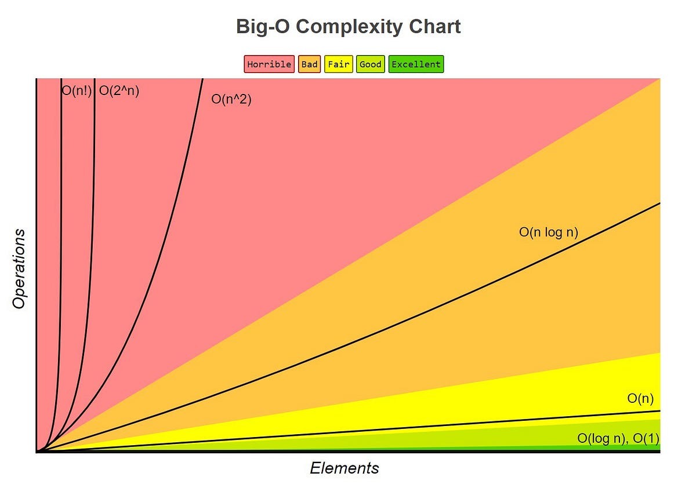
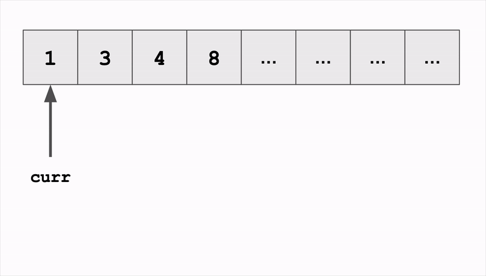
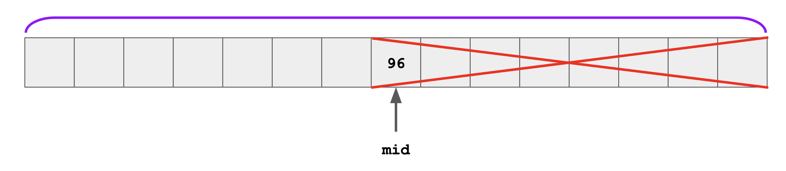
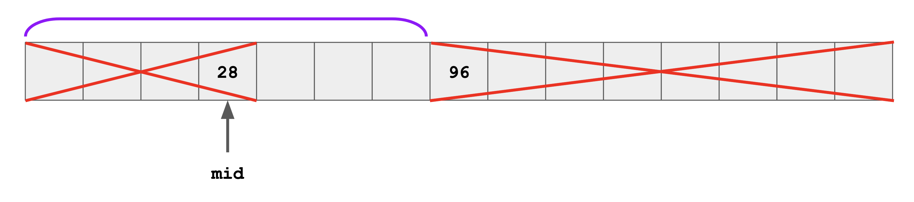
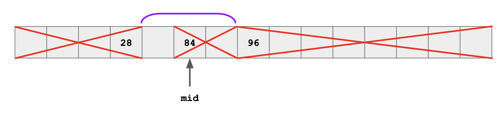
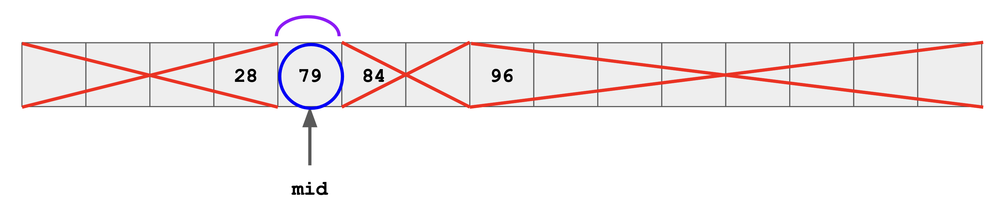

<h2 align=center>Week 01: <em>Day 1</em></h2>

<h1 align=center>Mutations v. Construction</h1>

<p align=center><strong><em>Song of the day</strong>: <a href="https://youtu.be/IF2t2CeDhGg?si=mdggY3cwKEYKRcHG"><strong><u>Way Out</u></strong></a> by FKJ (2022).</em></p>

---

## Sections

1. [**The Searching Problem**](#1)
    1. [**Linear Search**](#1-1)
    2. [**Sorted Search**](#1-2)
2. [**Binary Search**](#2)

---

<a id="1"></a>

## The Searching Problem

One of the most common problems found in computer science is that of _searching_. After all, so much of our day-to-day use of software depends on it: user / tag search on social media, database search in search engines, or even a simple quick loop-up for a file in your local file system. The quest to find the most efficient search algorithms is an ancient one, and over the last century we've come up with quite a few the cut the runtime of these operations so that users of software, like ourselves, can have a seamless experience.

Before we can explore one of the most elegant of these, let's analyse the "naïve" way of searching for a value inside a collection, say, of integers: by checking them one-by-one.

<a id="1-1"></a>

### Linear Search

So let's formally state the problem in question. Your job is to implement the following function:

```python
def linear_search(lst: list, val: int) -> int
```

Where `lst` is a list of integers and `val` is an integer value. The function should return the index in `lst` where `val` first appears, or `None` if `val` is not an element of `lst`.

For example:

```python
def main():
    integers = [5, 8, 12, 7, 8, 10]

    print(linear_search(integers, 8))
    print(linear_search(integers, 4))


if __name__ == "__main__":
    main()
```

Output:

```
1
None
```

Solution:

```python
def linear_search(lst: list, val: int) -> int:
    # Θ(n)
    for i in range(len(lst)):
        # Θ(1)
        if (lst[i] == val):
            return i  # Θ(1)
    
    return None  # Θ(1)
```

Since the algorithm has to, in the world-case scenario, check the entire list to find the value we're looking for, our linear search is...

> **T(`n`)** = **Θ(num<sub>iterations</sub>)**
>
> where the worst-case is # of iterations is `n`, so...
>
> **T<sub>worst</sub>(`n`)** = **Θ(`n`)**

Easy enough, yes? As you can see below, in the grand scheme of things, a runtime of Θ(`n`) is not that bad:

<a id="run"></a>



<sub>**Figure 1**: A simple comparison of how different runtimes grow as the input gets larger.</sub>

As you can see, Θ(`n`) fits into the "fair" category, which is by no means the best we can do. So, _can_ we do better?

<a id="1-2"></a>

### Sorted Search

Well, suppose we make the following assumption: say that the values inside of the list was sorted. At first glace, this doesn't seem like it helps up at all. We still have the same Θ(`n`) runtime:



<sub>**Figure 2**: Runtime of our current iteration.</sub>

So, how exactly does having a sorted list help us?

<a id="2"></a>

## Binary Search

Think about it this way: since the list is sorted, if we were able to determine on which _side_ of the list our target value is, we would be able to cut the average runtime by half:

```python
sorted_search(sorted_list, 79)
```

Well, in order to bisect this list, we have to find the number in the middle. Once we do, we confirm whether that value is _less than_ or _more than_ our target:



<sub>**Figure 3**: 96, the middle value, which is more than 79. Thus, we ignore the entire right-hand side.</sub>

This, technically, makes our runtime Θ(`n` / 2) which, in big-theta, equates to Θ(`n`). But what if we repeat this same process once more?



<sub>**Figure 4**: 28, the middle value, which is less than 79. Thus, we ignore the entire left-hand side.</sub>

Now, our runtime becomes:

> Θ((`n` / 2) / 2) = **Θ(`n` / 4)**

And again...



<sub>**Figure 5**: 84, the middle value, which is more than 79. Thus, we ignore the entire right-hand side.</sub>

> Θ((`n` / 4) / 2) = **Θ(`n` / 8)**

And finally...



<sub>**Figure 6**: We found the number (which is not always the case, of course)!</sub>

> Θ((`n` / 8) / 2) = **Θ(`n` / 16)**

At first glance, it may look like this is just another plain old Θ(`n`)...but is it really? As you can see, the more times we do this division, we get the following numbers:

> 2, 4, 8, 16, ...

These are the powers of two, right? We can thus generalise the runtime here to the following:

| Iteration | Size of search range            |
|-----------|---------------------------------|
| 1       | `n` = (`n` / (2<sup>0</sup>))     |
| 2       | `n` / 2 = (`n` / (2<sup>1</sup>)) |
| 3       | `n` / 4 = (`n` / (2<sup>2</sup>)) |
| 4       | `n` / 8 = (`n` / (2<sup>3</sup>)) |
| ...     | ...                               |
| `k`     | `n` / 2<sup>`k` - 1</sup>         |
| ...     | ...                               |
| ?       | 1                                 |

<sub>**Figure 7**: As the number of iterations (`k`) approaches infinity, the size of the search range becomes 1 (when we find the target). The reason for `k` - 1 instead of `k` is because we consider the finding of the first middle value as our first iteration, and because finding the middle value is an Θ(1) operation.</sub>

If we try to solve for `k` in the following formula, we can find the relationship between the number of iterations and the size of the data set:

> `n` / 2<sup>`k` - 1</sup> = 1
>
> `n` = 2<sup>`k` - 1</sup>
>
> log<sub>2</sub>(`n`) = log<sub>2</sub>(2<sup>`k` - 1</sup>)
>
> log<sub>2</sub>(`n`) = (`k` - 1) * log<sub>2</sub>(2)
>
> log<sub>2</sub>(`n`) = (`k` - 1), because log<sub>b</sub>(x) = log<sub>c</sub>(x) / log<sub>c</sub>(b)
>
> `k` = log<sub>2</sub>(`n`) + 1

If `k` is the number of iterations (that is, how many times our search look runs) then we can use it as the basis of our runtime analysis:

> `k` = log<sub>2</sub>(`n`) + 1 = **Θ(log<sub>2</sub>(`n`))**

Which, as we can see from our [**runtime chart**](#run), is a _significant_ improvement from what we had with linear search! This wonderful algorithm is known as **binary search**, and its [**Python implementation**](code/binary_search.py) can be seen below:

```python
def binary_search(sorted_list: list, val: int) -> int:
    start = 0                    # Θ(1)
    stop = len(sorted_list) - 1  # Θ(1)

    # Θ(number of iterations, k)
    while start <= stop:
        med_idx = (stop + start) // 2  # Θ(1)

        # Θ(1)
        if sorted_list[med_idx] == val:
            return med_idx
        elif sorted_list[med_idx] > val:
            stop = med_idx - 1
        else:
            start = med_idx + 1
        
    return None  # Θ(1)
```