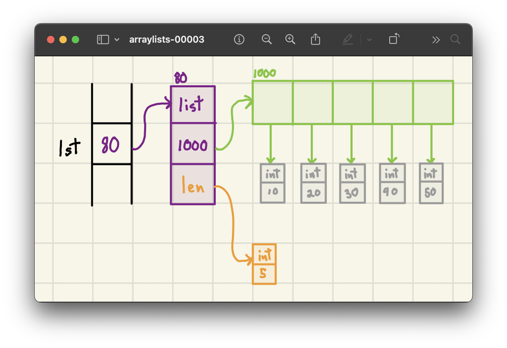

<h2 align=center>Week 04: <em>Day 2</em></h2>

<h1 align=center><code>ArrayList</code></h1>

<p align=center><strong><em>Song of the day</strong>: <a href="https://youtu.be/IF2t2CeDhGg?si=mdggY3cwKEYKRcHG"><strong><u>Way Out</u></strong></a> by FKJ (2022).</em></p>

---

## Sections

1. [**Python Lists and the Reality of `.append()`**](#1)
    1. [**`.append()` Under the Hood**](#1-1)
    2. [**Python Lists and Arrays**](#1-2)
    3. [**How `.append()` Works in Reality**](#1-3)
2. [**Amortised Analysis**](#2)
3. [**`ArrayList`**](#3)
    1. [**Dynamic Array Growth**](#3-1)
    2. [**The Python Implementation**](#3-2)
4. [**Addendum A: _Important Summations To Know_**](#4)
5. [**Addendum B: _Dunder Methods_**](#5)

---

<a id="1"></a>

## Python Lists and the Reality of `.append()`

<a id="1-1"></a>

### `.append()` Under the Hood

When we first learn to program in Python, we often assume that the `.append()` method simply places a new element directly into the next available memory slot. For example:

```python
lst = [1, 2, 3]
lst.append(4)
```

You might imagine `.append()` working like this:


<sub>**Figure 1**: How we might initially think `.append()` works, with the new value immediately placed at the next memory location.</sub>

However, this understanding is a bit misleading. In reality, Python's memory model doesn't guarantee that the memory adjacent to the list is available. The computer's RAM is being shared by many applications, which may already occupy those memory blocks. For instance, consider these memory allocations:

| Process Name | Memory in Use                    |
|--------------|----------------------------------|
| Python       | 0xfbc3b5ea - 0xfbc3c71a          |
|              | 0x2e48a424 - 0x4e48a424          |
| Zoom         | 0xd0c2f880 - 0xd4c2d133          |
| Firefox      | 0x54356cfe - 0x75336afe          |
| Slack        | 0x1dbbda19 - 0x1dbbcdee          |
| Steam        | 0x8906e993 - 0x892c453e          |

<sub>**Figure 2**: Example of memory blocks being used by various processes.</sub>

Since Python can't assume the next block is free, `.append()` does something much smarter.

<a id="1-2"></a>

### Python Lists and Arrays

Under the hood, Python lists are implemented using something called a **dynamic array**. At its core, this involves an **array**, which is a fixed-size data structure that:
- Stores a sequential collection of values.
- Has all its elements stored contiguously in memory.
- Requires all elements to be of the same size.

Consider this Python list:

```python
lst = [10, 20, 30, 40, 50]

print(len(lst))  # Output: 5
print(lst[4])    # Output: 50
```

Visually, the memory model for this list might look like this:



<sub>**Figure 3**: Memory model of a Python list.</sub>

Here’s what happens:
- The green boxes represent the **array** part of the list.
- Because arrays have a fixed size and are stored contiguously, we can access any element in **constant time** using this formula:
  ```
  Address of lst[k] = base_address_of_array + (k * size_of_an_element)
  ```

For example, if the base address is `0x4a003` and each element takes 8 bytes, the address of `lst[4]` can be calculated directly:
```
Address of lst[4] = 0x4a003 + (4 * 8) = 0x4a023
```

<a id="1-3"></a>

## **How `.append()` Works in Reality**

If arrays have a **fixed size**, how can Python lists grow dynamically? This is where **dynamic arrays** (also known as **ArrayLists**) come into play. Instead of directly appending elements into the next available memory slot, Python lists handle growth in a more sophisticated way:

1. **Preallocate Extra Memory:** When a list is created, Python allocates more memory than is immediately needed.
2. **Use Reserved Space:** `.append()` can add elements **without resizing** as long as there is free space available in this preallocated memory.
3. **Resize When Full:** If there is no more space, Python **allocates a larger array, copies the existing elements into it, and then appends the new element**.

This strategy prevents unnecessary resizing every time an element is added, making appends significantly more efficient.

  

<sub>**Figure 4**: When the array reaches its limit, a completely new array (ID `2000`) is created, and all elements are copied over.</sub>  

### **The Naïve Resizing Approach (Inefficient)**
A **simpler but inefficient** way to resize an array would be to increase its size by **just 1** every time an element is appended.

<a id="naive"></a>

  

<sub>**Figure 5**: Increasing the array size by 1 for every `.append()` call.</sub>  

Under this approach:
- Each `.append()` requires allocating a new array **one slot larger**, and copying all elements.
- Since copying takes **Θ(k)** time (where `k` is the current length of the list), the total time for `n` appends is:

  > **T(`n`)** = 1 + 2 + 3 + ... + `n` = **Θ(`n`²)**[**\***](#4)

This quadratic runtime is **extremely inefficient** for a commonly used operation like `.append()`. If Python lists worked this way, `.append()` would quickly become impractical for large lists.

### **The Optimized Resizing Approach (Efficient)**
Instead of increasing the size by 1, Python lists **double in size** whenever they run out of space. This is **far more efficient**.

<a id="optimised"></a>

  

<sub>**Figure 6**: When the array reaches capacity, it is resized to **double** its previous size.</sub>  

With **doubling**, the runtime behaves differently:
- **Best Case:** Ω(1) when there is available space.
- **Worst Case:** O(`k`) when resizing happens.

The total time for `n` appends is now:

> **T(`n`)** = 1 + 2 + 4 + 8 + ... + `n` = **Θ(`n`)**[**\***](#4)

Since doubling the array does't happen anywhere as much as indexing and placing an element, the **average ( or _amortized_) time per `.append()` operation is Θ(1)**, making list growth **efficient** in the long run.

<br>

<a id="2"></a>

## Amortised Analysis

At first glance, the **doubling strategy** may seem inefficient—after all, copying `n` elements during a resize takes Θ(`n`) time. However, because the **frequency of resizes decreases exponentially**, the overall cost of appending `n` elements remains Θ(`n`). 

This brings us to an important concept in algorithm analysis: **amortized Analysis**, which helps explain why `.append()` is **efficient on average**, even though some operations take longer than others. According to [**Wikipedia**](https://en.wikipedia.org/wiki/Amortized_analysis):

> _The motivation for amortized analysis is that looking at the worst-case run time can be too pessimistic. Instead, amortized analysis averages the running times of operations in a sequence over that sequence._

We measure this by the following formula:

> **T<sub>amortised</sub>(`n`) = total cost of the entire series of operations / `n`**

This means that for our [**naive approach**](#naive), our amortised runtime is as follows:

> **T<sub>amortised</sub>(`n`)** = Θ(`n`<sup>2</sup>) / `n` = **Θ(`n`)**

And our [**optimised approach**](#optimised) is:

> **T<sub>amortised</sub>(`n`)** = Θ(`n`) / `n` = **Θ(`1`)**

<br>

<a id="3"></a>

## **`ArrayList`: The True Story of Python Lists**

When we use `.append()` on a Python list, the underlying mechanics involve more than just placing a new value at the next available memory location. Let’s walk through what happens behind the scenes with this simple code:

```python
lst = []
for i in range(1, 6):
    lst.append(10 * i)
```

<a id="3-1"></a>

### **Dynamic Array Growth**

Initially, the list starts with a small capacity—just enough to hold a single element. As we append elements, Python dynamically resizes the list when necessary. The result is something like this:


<sub>**Figure 6**: The list's capacity doubles each time it runs out of space, resulting in three resizing operations here.</sub>

This process isn't as straightforward as it seems. Python doesn't simply expand the existing memory; instead, it creates a completely new, larger array, copies the existing elements into it, and then appends the new element. A more accurate representation of this would look like this:


<sub>**Figure 7**: The array portion of the list is stored in a separate memory location, and the resizing involves copying data to this new space.</sub>

<a id="3-2"></a>

### **The Python Implementation**

Behind the scenes, Python lists rely on a dynamic array implementation. While we can't see the exact C-level details directly, we can simulate a simplified version in Python:

```python
from ctypes import py_object

def make_array(size):
    """
    Returns a low-level C-style array of the specified size.
    
    Args:
        size (int): Desired size of the array.
    Returns:
        Array: A new low-level array of the specified size.
    """
    return (size * py_object)()

class ArrayList:
    def __init__(self):
        self.data_arr = make_array(1)  # Start with capacity for 1 element
        self.capacity = 1
        self.size = 0  # Track the current number of elements

    def append(self, value):
        if self.size == self.capacity:  # Need to resize
            self.resize(self.capacity * 2)
        self.data_arr[self.size] = value
        self.size += 1

    def resize(self, new_capacity):
        """
        Resize the array to a new capacity.
        """
        new_arr = make_array(new_capacity)
        for i in range(self.size):
            new_arr[i] = self.data_arr[i]
        self.data_arr = new_arr
        self.capacity = new_capacity

    def __len__(self):
        return self.size

    def __getitem__(self, idx):
        if not 0 <= idx < self.size:
            raise IndexError("Index out of range")
        return self.data_arr[idx]

    def __setitem__(self, idx, value):
        if not 0 <= idx < self.size:
            raise IndexError("Index out of range")
        self.data_arr[idx] = value
```

In this implementation:
- The `resize` method handles the creation of a larger array and the transfer of existing elements.
- `append` doubles the array’s capacity when needed, ensuring efficiency over multiple appends.

<br>

<a id="4"></a>

## Addendum A: _Important Summations To Know_

1. 

> 1 + 2 + 3 + 4 + 5 + ... + `n` = `n`(`n` - 1) / 2 = **Θ(`n`<sup>2</sup>)**

2.

> 1 + 2 + 3 + 4 + 5 + ... + √`n` = **Θ(`n`)**

3.

> 1 + 2 + 3 + 4 + 5 + ... + log(`n`) = **Θ(log<sup>2</sup>(`n`))**

4.

> 1 + 2 + 4 + 8 + 16 + ... + 2<sup>`n`</sup> = 2<sup>`n` - 1</sup> - 1 = **Θ(`n`<sup>2</sup>)**

5.

> 1 + 2 + 4 + 8 + 16 + ... + `n` = 2`n` - 1 = **Θ(`n`)**

<br>

<a id="5"></a>

## Addendum B: _Dunder Methods_

```markdown
| Common Syntax     | Special Method Form                  |
|--------------------|--------------------------------------|
| `a + b`           | `a.__add__(b)`, alternatively `b.__radd__(a)` |
| `a - b`           | `a.__sub__(b)`, alternatively `b.__rsub__(a)` |
| `a * b`           | `a.__mul__(b)`, alternatively `b.__rmul__(a)` |
| `a / b`           | `a.__truediv__(b)`, alternatively `b.__rtruediv__(a)` |
| `a // b`          | `a.__floordiv__(b)`, alternatively `b.__rfloordiv__(a)` |
| `a % b`           | `a.__mod__(b)`, alternatively `b.__rmod__(a)` |
| `a ** b`          | `a.__pow__(b)`, alternatively `b.__rpow__(a)` |
| `a << b`          | `a.__lshift__(b)`, alternatively `b.__rlshift__(a)` |
| `a >> b`          | `a.__rshift__(b)`, alternatively `b.__rrshift__(a)` |
| `a & b`           | `a.__and__(b)`, alternatively `b.__rand__(a)` |
| `a ^ b`           | `a.__xor__(b)`, alternatively `b.__rxor__(a)` |
| `a | b`           | `a.__or__(b)`, alternatively `b.__ror__(a)` |
| `a += b`          | `a.__iadd__(b)`                     |
| `a -= b`          | `a.__isub__(b)`                     |
| `a *= b`          | `a.__imul__(b)`                     |
| `+a`              | `a.__pos__()`                       |
| `-a`              | `a.__neg__()`                       |
| `~a`              | `a.__invert__()`                    |
| `abs(a)`          | `a.__abs__()`                       |
| `a < b`           | `a.__lt__(b)`                       |
| `a <= b`          | `a.__le__(b)`                       |
| `a > b`           | `a.__gt__(b)`                       |
| `a >= b`          | `a.__ge__(b)`                       |
| `a == b`          | `a.__eq__(b)`                       |
| `a != b`          | `a.__ne__(b)`                       |
| `a in b`          | `a.__contains__(b)`                 |
| `a[k]`            | `a.__getitem__(k)`                  |
| `a[k] = v`        | `a.__setitem__(k, v)`               |
| `del a[k]`        | `a.__delitem__(k)`                  |
| `a(arg1, arg2, ...)` | `a.__call__(arg1, arg2, ...)`    |
| `len(a)`          | `a.__len__()`                       |
| `hash(a)`         | `a.__hash__()`                      |
| `iter(a)`         | `a.__iter__()`                      |
| `next(a)`         | `a.__next__()`                      |
| `bool(a)`         | `a.__bool__()`                      |
| `float(a)`        | `a.__float__()`                     |
| `int(a)`          | `a.__int__()`                       |
| `repr(a)`         | `a.__repr__()`                      |
| `reversed(a)`     | `a.__reversed__()`                  |
| `str(a)`          | `a.__str__()`                       |
```